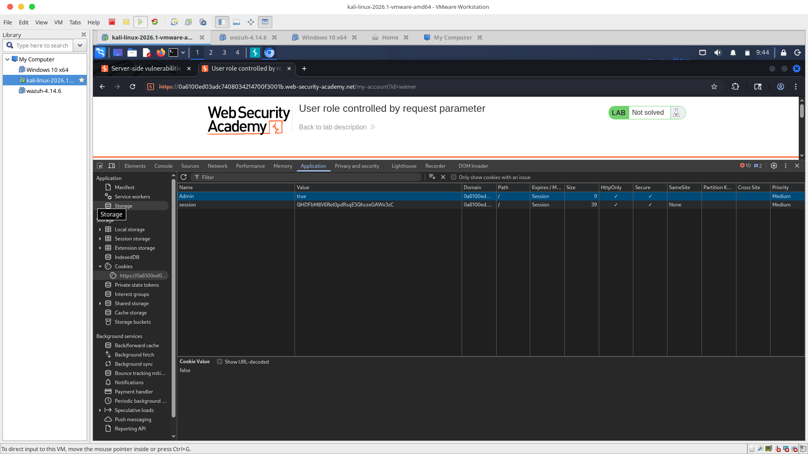
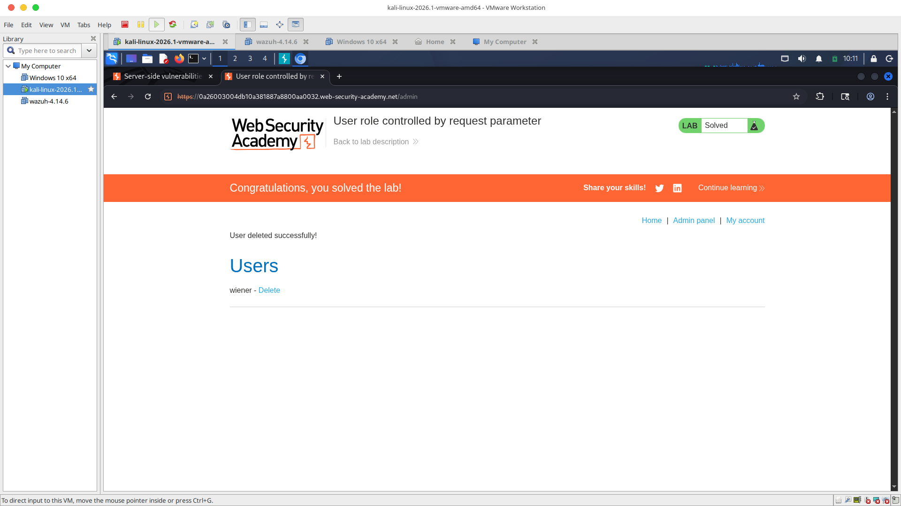

# 🔹 Lab 01: User Role Controlled by Request Parameter

## 📊 Vulnerability Classification
* **OWASP Top 10:** A01:2021 – Broken Access Control
* **Vulnerability Type:** Client-Side Cookie Parameter Manipulation / Privilege Escalation
* **Severity:** High 🔴

---

## 📝 Technical Overview
The web application incorrectly trusts state parameters controlled entirely by the user's browser client to enforce vertical privilege boundaries. While administrative links were removed from the public HTML UI layer, the backend authentication mechanism fails to validate session privileges on the server-side, relying instead on a forgeable client-side cookie key.

By modifying the cookie state, an unprivileged user can force authorization onto restricted pathways and access corporate administrative actions without authorization.

---

## 🚀 Step-by-Step Methodology

### 1️⃣ Phase 1: Client-Side State Reconnaissance
1. Authenticated into the platform using standard low-privilege consumer testing credentials (`wiener:peter`).
2. Map current cookie parameters by inspecting the local storage layer via native browser developer tools (`F12`).
3. Discovered an explicit authorization parameter string token tracking state labeled: `Admin=false`.

### 2️⃣ Phase 2: Token Forgery & Access Bypass
1. Expanded the **Application / Storage** tab console drawer and navigated down into the active cookie registry container.
2. Double-clicked the value field matrix string on the `Admin` cookie row, modified it manually from `false` to **`true`**, and saved it to the active browser memory cache.
3. Forced URL endpoint directory navigation within the address bar by manually modifying the profile path parameter to: `/admin`.
4. The backend server parsed the forged token, bypassed access checks, and successfully loaded the restricted corporate console panel view.

### 3️⃣ Phase 3: Administrative Purge Execution
1. Pinpointed the target account profile row entry for the user `carlos`.
2. Clicked the destructive `Delete` function command button to execute an unauthorized database purge call and cleanly solve the laboratory module environment.

---

## 📸 Technical Portfolio Artifacts
* **Exploit Verification:** 
* **Remediation Proof:** 

---

## 🛡️ Defensible Security Remediation
* **Server-Side Verification:** Never rely on client-side state cookies, parameters, or values to track user roles or permissions. All access configuration gates must be parsed and strictly verified on the server-side architecture.
* **Cryptographic Tokens:** If role parameters are handled on the client-side, leverage secure, tamper-proof session states such as signed JSON Web Tokens (JWT) or server-mapped cryptographically randomized session IDs.
