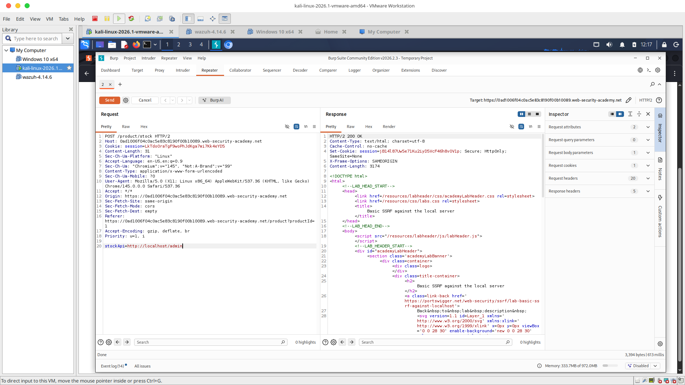
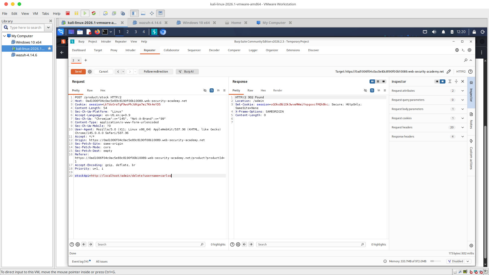
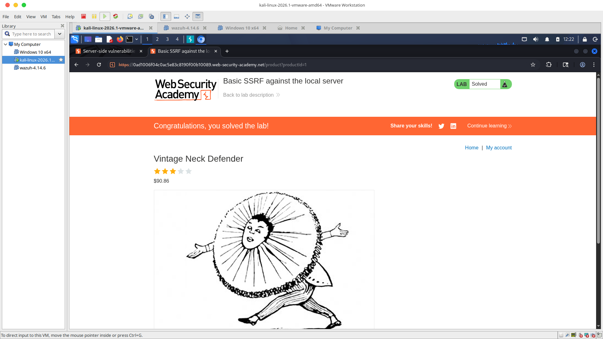

# 🔹 Lab 03: Basic SSRF Against the Local Server

## 📊 Vulnerability Classification
* **OWASP Top 10:** A10:2021 – Server-Side Request Forgery (SSRF)
* **Vulnerability Type:** Unvalidated External URL Resource Fetching / Loopback Request Hijacking
* **Severity:** High 🔴

---

## 📝 Technical Overview
The web application hosts a product data checking feature that maps out warehouse quantities by parsing an input API endpoint parameter variable (`stockApi=`). Because the server blindly trusts this user-supplied address without sanitation or zone checking, it can be manipulated into issuing server-to-server connection requests on behalf of the attacker.

This allows external attackers to route traffic directly through the trusted server's local loopback network adapter interface (`127.0.0.1` / `localhost`), completely bypassing network-layer firewall access lists to pull down restricted administrative consoles.

---

## 🚀 Step-by-Step Methodology

### 1️⃣ Phase 1: Operational Request Extraction
1. Loaded an active product storefront page and located the stock verification trigger utility button.
2. Toggled the local proxy intercept listener framework to **ON** and clicked `Check stock` to trap the live connection packet mid-transit over the network wire.
3. Isolated the trapped request structure displaying a clear text target: `POST /product/stock HTTP/2`.
4. Duplicated and transported the captured data package directly over into the manual request testing workbench (**Burp Suite Repeater**).

### 2️⃣ Phase 2: Server Loopback Request Forgery
1. Highlighted the backend API target endpoint path string variable sitting right on line 20 after the parameters equals indicator flag (`stockApi=`).
2. Erased the remote third-party warehouse link entirely and replaced the token values with the internal restricted network loop adapter layer path: **`http://localhost/admin`**.
3. Clicked the manual execution tool button **Send** to force-route the server's internal requests to itself.
4. The backend server successfully processed the query natively, dropped its security guard, and returned an administrative structure dump layout alongside a clean HTTP status code profile confirmation of **`HTTP/2 200 OK`**.

### 3️⃣ Phase 3: Exploit Chain Execution & Administrative Purge
1. Ran a textual code discovery query (`Ctrl + F`) within the right-hand HTML Response block pane to parse administrative command lines assigned to the user string profile: `carlos`.
2. Extracted the specific account deletion execution endpoint variable string token from the server response: `/delete?username=carlos`.
3. Updated the Repeater left input pane on line 20, chaining the path together: `stockApi=http://localhost/admin/delete?username=carlos`.
4. Dispatched the final payload injection wave. The server executed the local command and returned an **`HTTP/2 302 Found` (Redirect)** status code. This verified that the administrative database row elements for Carlos were successfully purged over the wire.

---

## 📸 Technical Portfolio Artifacts
* **Admin Privilege Discovery:** 
* **Exploit Purge Validation:** 
* **Remediation Proof:** 

---

## 🛡️ Defensible Security Remediation
* **Input Domain Allow-lists:** Enforce strict, positive server-side allow-lists on any parameter that accepts remote endpoint data URLs. The system must completely drop any request string mapping that does not match pre-approved domain signatures.
* **Disable Local Interface Routing:** Block the web application user context from communicating with loopback adapters (`localhost`, `127.0.0.1`) or private internal RFC 1918 class networks (`10.0.0.0/8`, `192.168.0.0/16`) at the firewall routing table layers.
